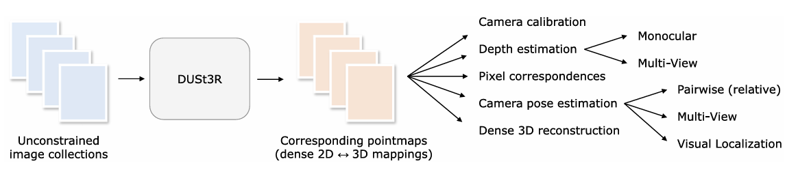
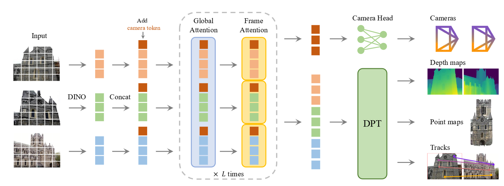
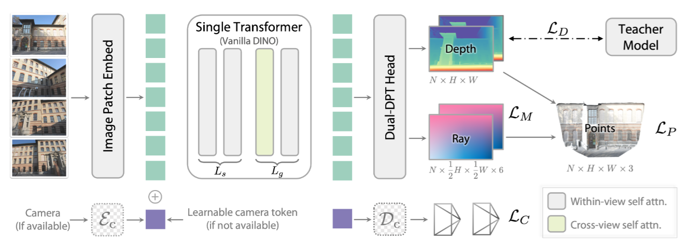
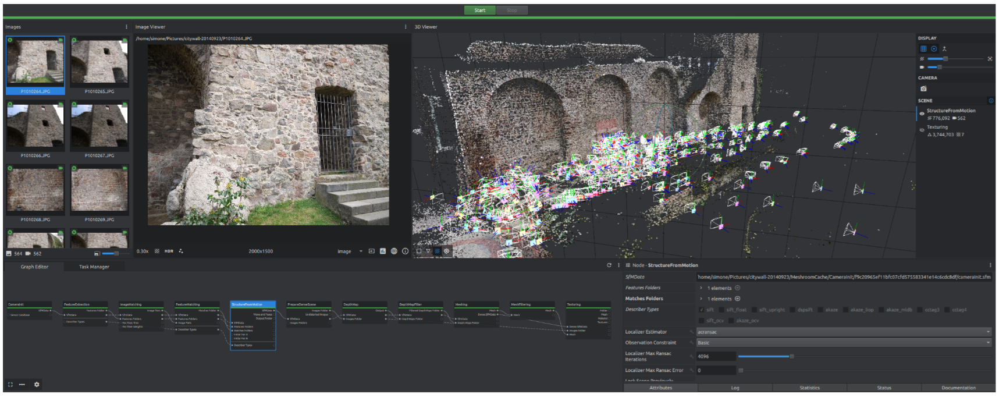

# A Description of each of the Reconstruction Methods - From Perplexity AI

## COLMAP - Structure-from-Motion Revisited

**Structure-from-Motion Revisited** is a 2016 CVPR paper by Johannes L. Schönberger and Jan-Michael Frahm that redesigns incremental SfM (Structure-from-Motion) to be more robust, accurate, complete, and scalable, and it became the basis for COLMAP’s open-source reconstruction pipeline.

### COLMAP Pipeline Workflow

### 1. Input images
- Collect an unordered or ordered set of images of the scene.  
- COLMAP supports reconstruction of both sparse and dense geometry from these images.

### 2. Feature extraction
- Detect keypoints and compute local descriptors for every image.  
- This creates the feature database used by later matching and reconstruction stages.

### 3. Feature matching
- Match features across image pairs using a matcher such as:
  - `exhaustive_matcher`
  - `sequential_matcher`
  - `vocab_tree_matcher`  
- Geometric verification removes bad correspondences and builds the scene graph for SfM.

### 4. Sparse reconstruction
- Start incremental SfM with `mapper`.  
- COLMAP seeds reconstruction from a strong initial image pair, then repeatedly:
  - registers a new image,
  - triangulates new points,
  - runs bundle adjustment,
  - filters outliers,
  - continues growing the model.

### 5. Sparse model output
- The result is a sparse 3D point cloud plus estimated camera poses.  
- Multiple disconnected sparse models may be produced if the image collection breaks into separate components.

### 6. Image undistortion
- Use the sparse model to undistort images before dense reconstruction.  
- This prepares consistent camera geometry for Multi-View Stereo.

### 7. Dense reconstruction
- Run PatchMatch stereo to estimate depth maps.  
- Then fuse the depth maps into a denser 3D representation.

### 8. Mesh generation
- Optionally convert the dense point cloud into a mesh using Poisson or Delaunay meshing.  
- This produces a surface model suitable for visualization or downstream use.

### Simple command flow

```text
feature_extractor -> matcher -> mapper -> image_undistorter -> patch_match_stereo -> stereo_fusion -> meshing
```
---

## NeRF - NeRF: Representing Scenes as Neural Radiance Fields for View Synthesis

NeRF is a method for turning a set of photos of a scene into a continuous 3D representation that can render new viewpoints with very realistic lighting and detail. In plain English, it teaches a neural network to answer: “If I stand at this 3D point and look in this direction, what color and how much stuff is there?”.

### What the paper solves

The paper tackles **view synthesis**: given images from some camera positions, generate what the scene would look like from a new camera position. Traditional methods often relied on explicit surfaces or voxels, which can struggle with fine details, transparency, and view-dependent effects like reflections. NeRF instead represents the scene as a continuous function, so it is not limited by a fixed 3D grid.

### How the model works

NeRF uses a fully connected neural network that takes two things as input: a 3D location (x,y,z) and a viewing direction. For that location and direction, the network predicts two outputs: the **density** of matter at that point and the **emitted color** seen from that direction. Density tells the renderer how likely light is to be blocked or absorbed there, while color tells it what light leaves that point toward the camera.


To render an image, NeRF traces a ray through every pixel of the virtual camera into the 3D scene and samples many points along that ray. At each sampled point, it asks the network for color and density, then combines all those samples using volume rendering to compute the final pixel color. That is the key trick: the scene is never stored as a mesh or point cloud; it is stored implicitly in the network’s weights.


### Why it can render new views

The network is trained so that, when the rendered image from a known camera pose is compared to the real photo, the difference is small. Because the training uses many posed images of the same scene, the model learns a consistent 3D explanation that works from all viewpoints. Once trained, you can move the virtual camera anywhere and render a new view by repeating the same ray-sampling process.

### Why the result looks good

A major strength of NeRF is that it models **view dependence**, meaning the same point can look different depending on angle. That matters for shiny surfaces, glass, and subtle lighting effects, where the observed color is not just a property of the object but also of the viewing direction. This is one reason NeRF often produces more realistic novel views than older methods.

### Training in practice

The original paper trains one network per scene, rather than a single universal model for all scenes. It also uses positional encoding to help the network represent fine spatial detail, since ordinary neural networks tend to oversmooth high-frequency patterns. In effect, the method starts with a blurry shape and gradually learns sharper geometry, textures, and lighting effects as training continues.

### Intuition in one example

Imagine a room photographed from many spots. NeRF learns a function that can answer: “At this exact point in space, how solid is it, and what color does it appear from this angle?”. When rendering a new photo, it sends a ray through each pixel, collects those answers along the ray, and blends them into the final image. If a chair blocks the wall, the chair’s density dominates the ray and the wall contributes less, which is how occlusion is modeled.

### Main takeaway

The paper’s core idea is surprisingly simple: **replace an explicit 3D model with a neural function that can be queried anywhere in space and from any direction**. That function is trained from posed images using differentiable volume rendering, and the result is a scene representation that can synthesize highly realistic new views.

---

## Dust3r

DUSt3R is a **pairwise 3D reconstruction model** that skips camera calibration and pose estimation up front, and instead directly predicts dense 3D point maps from images. In plain English, it tries to answer: “For every pixel in these photos, where is that point in 3D space?”.

### What the paper solves

Traditional SfM and MVS pipelines usually depend on calibrated cameras, feature matching, triangulation, and separate pose estimation steps. DUSt3R removes that dependency by learning to reconstruct geometry directly from image pairs, even when the camera intrinsics and viewpoints are unknown. The result is a more unified system for depth, pose, and reconstruction tasks.

### Core idea

The model predicts a **point map** for each image, meaning every pixel is assigned a 3D coordinate instead of just a depth value. Those point maps encode both scene geometry and correspondence information, so matching pixels across views and inferring camera motion become downstream steps rather than separate hand-designed modules. This is the central design choice that makes DUSt3R feel different from classic geometry pipelines.



### How it works

DUSt3R takes a pair of images and processes them with a Transformer-based encoder-decoder architecture. The network jointly sees both images and regresses dense 3D point maps for them, learning how 2D image structure maps to 3D shape during training. Because the model predicts geometry directly, it can later recover depth, relative pose, camera parameters, and pixel correspondences from the predicted point maps.

### Why point maps matter

A point map is more informative than a depth map because it gives a 3D location for each pixel, not just distance along one camera ray. That means the representation can naturally support multi-view alignment: if two images observe the same scene point, their predicted 3D points should line up after the correct rigid transform is found. This also lets the system handle scenes with little or no prior calibration, because the geometry is inferred jointly rather than imposed beforehand.

### Multi-view reconstruction

For more than two images, DUSt3R uses an optimization step to globally align the predicted point maps into a shared 3D frame. Once aligned, the model can produce a full scene reconstruction and recover the usual outputs of SfM/MVS pipelines, such as camera poses and dense geometry. In that sense, it behaves like a learned front end plus a geometry alignment back end.

### What is impressive

The paper shows that this one model can do several 3D vision tasks well, including monocular and multi-view depth estimation, relative pose estimation, and reconstruction from arbitrary image collections. Its appeal is not that it replaces all geometry, but that it makes the pipeline much simpler by learning the hardest correspondences and geometric priors directly. That is why the authors describe it as making geometric 3D vision “easy”.

### Plain-English intuition

Think of DUSt3R as a system that looks at photos and says, “I don’t know the camera setup yet, but I can still guess where the visible surfaces are in 3D.”  Then it lines up those guesses across images until everything fits into one consistent scene. Instead of first solving camera calibration and feature matching, it learns a representation where those answers can be recovered afterward.

### Main takeaway

The paper’s big idea is to replace the classical “estimate cameras first, then reconstruct” workflow with a learned dense 3D prediction task. DUSt3R predicts point maps from images, and those point maps are rich enough to recover depth, pose, correspondences, and full 3D structure. In practice, that makes it a unified and surprisingly direct alternative to traditional SfM/MVS pipelines.

---

## VGGT

VGGT is a feed-forward 3D vision model that directly predicts camera parameters, depth maps, point maps, and 3D point tracks from one or many images in a single pass. In plain English, it tries to replace a chunk of the usual SfM/MVS pipeline with one transformer that “understands” scene geometry well enough to infer the important 3D pieces directly.

### What problem it solves

Classic 3D reconstruction pipelines usually rely on separate stages for feature matching, camera pose estimation, depth estimation, and geometric optimization. VGGT aims to unify those tasks so the model can infer all the main geometric outputs at once, without post-processing refinement. The paper emphasizes that it is both simple and fast, reconstructing scenes in under a second for many inputs.

### How the model works

VGGT takes a set of images and turns them into tokens, typically using a visual backbone such as DINO-style image embeddings, then adds special camera-related tokens before feeding everything into a large transformer. The transformer alternates between attention within each frame and attention across all frames, so it can understand both local image content and multi-view geometry at the same time. After that, separate heads predict camera pose, depth, point maps, and tracks.



### Why alternating attention matters

The alternating-attention design is the key architectural idea. Frame-wise attention helps the model understand each image on its own, while global attention lets it compare views and reason about shared 3D structure. That balance is what makes the network good at both per-image understanding and multi-view alignment.

### What each output means

Camera prediction gives the model’s estimate of intrinsics and extrinsics, which tells you where each photo was taken from. Depth maps tell you how far surfaces are from each camera, while point maps directly assign 3D coordinates to pixels. Track predictions follow selected image points across views, which helps with correspondence and scene understanding.

### Why it is useful

VGGT is designed to be a **unified** geometry model rather than a task-specific one. That means you can use the same model for pose estimation, dense reconstruction, depth prediction, and tracking instead of chaining together several separate systems. The paper reports state-of-the-art results on multiple 3D tasks and says the model generalizes well to unseen datasets.

### Intuition in plain English

Think of VGGT as a very strong visual guesser: it looks at all the photos together and says, “Here is where the cameras are, here is the 3D shape, here is the depth, and here are the corresponding points across images”. Instead of first finding matches and then solving geometry explicitly, it learns geometry-aware representations end to end. That is why the paper describes it as a feed-forward, geometry-grounded transformer.

### Main takeaway

The main contribution of VGGT is not a new classical geometry algorithm, but a transformer that learns to output the geometric quantities that traditional pipelines labor to recover step by step. In practice, that makes 3D reconstruction simpler, faster, and more unified, while still producing useful camera and scene structure.

---

## Depth Anything 3: Recovering the Visual Space from Any Views

Depth Anything 3 (DA3) is a unified 3D vision model that reconstructs spatially consistent geometry from one image or many views, even when camera poses are unknown. In plain English, it looks at visual inputs and predicts the scene’s 3D layout in a way that stays consistent across viewpoints, rather than treating each image as an isolated depth-estimation problem. 

### What problem it solves
Older pipelines often split the job into separate tasks like monocular depth, multi-view stereo, camera pose estimation, and rendering. DA3 aims to fold those into a single model that can recover “visual space” from any view configuration, including single images, stereo pairs, multi-view sets, and video. The paper’s main claim is that this can be done with minimal architectural complexity.

### Core idea
DA3 uses a **single plain transformer** as its backbone, without specialized geometry modules. Instead of predicting many different task-specific outputs, it focuses on a singular **depth-ray** target, which combines depth with ray geometry into one representation. This keeps the model simpler while still encoding enough information to recover 3D structure.

### How it works
The model takes visual inputs and processes them with a transformer encoder, then uses a DPT-style reassembly and dual-head design to output dense geometry. One output is a depth map, and the other is a dense ray map that encodes the ray origin and direction for each pixel. Together, those outputs describe where each pixel lies in 3D and how to place it consistently across views.



### Why the ray target matters
A plain depth map only tells you distance from the camera, which is useful but incomplete. The ray map adds the camera geometry for each pixel, so the model can reason about the actual 3D line that produced that pixel. That makes it easier to reconstruct consistent geometry from multiple views and to recover camera pose.

### Training strategy
DA3 uses a teacher-student training setup to reach detail and generalization comparable to Depth Anything 2. The paper says all models are trained using public academic datasets only. This is important because it suggests the gains come from the representation and training design, not from private data scale.

### What it can do
The model is meant to handle camera pose estimation, any-view geometry, visual rendering, and monocular depth estimation in one framework. The project page says DA3 also achieves strong 3D Gaussian-style reconstruction and “recovers the space” from arbitrary visual inputs. In practical terms, that means you can feed it images from different viewpoints and get geometry that lines up consistently in 3D.

### Plain-English intuition
Think of DA3 as a very general geometry interpreter: it does not just guess depth for one photo, but tries to infer the 3D visual space behind all the views together. Its trick is to keep the model simple and use a geometry-rich target so the transformer learns both what is in the scene and how the views relate to each other. That is why the paper positions it as a “minimal modeling” approach to visual geometry.

### Main takeaway
DA3’s main contribution is showing that a single transformer, trained on a depth-ray representation, can recover consistent 3D geometry from arbitrary visual inputs with no special geometric machinery. The result is a simpler and more general 3D vision system that can handle depth, pose, multi-view reconstruction, and rendering in one model.

---

## AliceVision Meshroom: An open-source 3D reconstruction pipeline

AliceVision Meshroom is an open-source, node-based photogrammetry pipeline for reconstructing 3D scenes from images. In plain English, it takes photos of an object or scene and turns them into a sparse 3D point cloud, a denser mesh, and a textured model.

### What the paper is about
The paper introduces **Meshroom** as the user-facing software and **AliceVision** as the underlying computer vision framework. Its goal is to provide a flexible, open-source reconstruction system that works with images from phones or professional cameras and scales from a few photos to thousands. A key design choice is modularity: the pipeline is built from nodes that can be edited, reused, and extended.



### Main pipeline
The default reconstruction pipeline has two big stages: **Structure-from-Motion** and **Multi-View Stereo**. SfM estimates camera poses and builds a sparse point cloud, while MVS densifies the reconstruction by estimating depth maps and producing a fuller surface. After that, the system performs meshing, mesh filtering, and texturing to create the final output.

### How it works
First, Meshroom initializes cameras and extracts image features. Then it matches those features across image pairs to find correspondences that can be triangulated into 3D points. Once enough images are connected, SfM estimates the camera motion and sparse scene structure; afterward, the MVS stage computes depth maps, filters them, and converts them into a mesh.

### Why the node system matters
Meshroom is built around a **nodal engine**, meaning each step is a node in a directed acyclic graph. That makes the pipeline easy to customize because users can add, remove, or reorder nodes, rerun only affected parts, and inspect intermediate results. The paper highlights that this design is useful not just for researchers, but also for artists and production workflows.

### Notable implementation details
AliceVision supports several matching methods, including brute-force, Cascade Hashing, and a KD-tree/FLANN-based approach that is used by default. For dense reconstruction, the system computes depth maps and then fuses them into geometry before texturing the mesh using UV mapping and multi-band blending. The paper also notes that Meshroom can run locally or on render farms and relies on open formats to improve interoperability.

### Plain-English summary
If COLMAP is a compact research-style SfM system, Meshroom is a more **production-friendly** reconstruction workflow with a visual node editor. You feed in photos, it finds how the cameras moved, estimates the 3D shape, turns that into a surface, and paints the surface with texture from the original images. The big contribution of the paper is showing how to package that into a modular, open-source toolchain that can be customized for many 3D tasks.

### Main takeaway
Meshroom’s paper is less about inventing a new reconstruction algorithm and more about building a complete, open, extensible 3D reconstruction pipeline around existing photogrammetry ideas. Its strength is the combination of SfM, MVS, meshing, and texturing in a flexible node-based system that is practical for both research and real production work.

---

# References

Schonberger, J. L., & Frahm, J.-M. (2016). Structure-from-Motion Revisited. 2016 IEEE Conference on Computer Vision and Pattern Recognition (CVPR), 4104–4113. https://doi.org/10.1109/CVPR.2016.445

Mildenhall, B., Srinivasan, P. P., Tancik, M., Barron, J. T., Ramamoorthi, R., & Ng, R. (2020). NeRF: Representing Scenes as Neural Radiance Fields for View Synthesis (arXiv:2003.08934). arXiv. https://doi.org/10.48550/arXiv.2003.08934

Wang, S., Leroy, V., Cabon, Y., Chidlovskii, B., & Revaud, J. (2024). Dust3r: Geometric 3d vision made easy. In Proceedings of the IEEE/CVF conference on computer vision and pattern recognition (pp. 20697-20709). https://doi.org/10.48550/arXiv.2312.14132

Wang, J., Chen, M., Karaev, N., Vedaldi, A., Rupprecht, C., & Novotny, D. (2025). Vggt: Visual geometry grounded transformer. In Proceedings of the Computer Vision and Pattern Recognition Conference (pp. 5294-5306). https://doi.org/10.48550/arXiv.2503.11651

Lin, H., Chen, S., Liew, J., Chen, D. Y., Li, Z., Shi, G., ... & Kang, B. (2025). Depth anything 3: Recovering the visual space from any views. arXiv preprint arXiv:2511.10647. 
https://doi.org/10.48550/arXiv.2511.10647

Carsten Griwodz, Simone Gasparini, Lilian Calvet, Pierre Gurdjos, Fabien Castan, et al.. AliceVision Meshroom: An open-source 3D reconstruction pipeline. 12th ACM Multimedia Systems Conference (MMSys 2021),
Sep 2021, Istanbul, Turkey. pp.241-247, https://doi.org/10.1145/3458305.3478443.