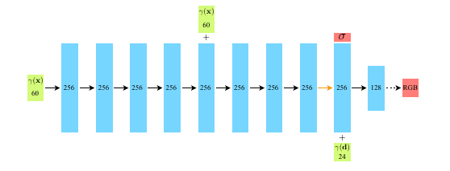
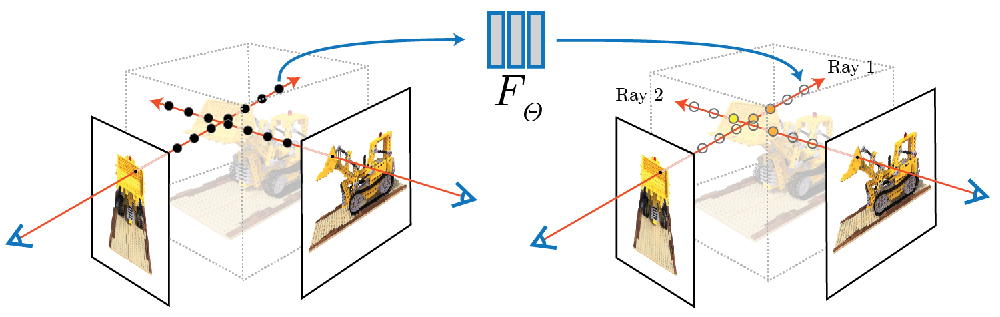

# A Description of each of the Reconstruction Methods

## COLMAP - Structure-from-Motion Revisited

**Structure-from-Motion Revisited** is a 2016 CVPR paper by Johannes L. Schönberger and Jan-Michael Frahm that redesigns incremental SfM (Structure-from-Motion) to be more robust, accurate, complete, and scalable, and it became the basis for COLMAP’s open-source reconstruction pipeline.

### COLMAP Pipeline Workflow

### 1. Input images
- Collect an unordered or ordered set of images of the scene.  
- COLMAP supports reconstruction of both sparse and dense geometry from these images.

### 2. Feature extraction
- Detect keypoints and compute local descriptors for every image.  
- This creates the feature database used by later matching and reconstruction stages.

### 3. Feature matching
- Match features across image pairs using a matcher such as:
  - `exhaustive_matcher`
  - `sequential_matcher`
  - `vocab_tree_matcher`  
- Geometric verification removes bad correspondences and builds the scene graph for SfM.

### 4. Sparse reconstruction
- Start incremental SfM with `mapper`.  
- COLMAP seeds reconstruction from a strong initial image pair, then repeatedly:
  - registers a new image,
  - triangulates new points,
  - runs bundle adjustment,
  - filters outliers,
  - continues growing the model.

### 5. Sparse model output
- The result is a sparse 3D point cloud plus estimated camera poses.  
- Multiple disconnected sparse models may be produced if the image collection breaks into separate components.

### 6. Image undistortion
- Use the sparse model to undistort images before dense reconstruction.  
- This prepares consistent camera geometry for Multi-View Stereo.

### 7. Dense reconstruction
- Run PatchMatch stereo to estimate depth maps.  
- Then fuse the depth maps into a denser 3D representation.

### 8. Mesh generation
- Optionally convert the dense point cloud into a mesh using Poisson or Delaunay meshing.  
- This produces a surface model suitable for visualization or downstream use.

### Simple command flow

```text
feature_extractor -> matcher -> mapper -> image_undistorter -> patch_match_stereo -> stereo_fusion -> meshing
```
---

## NeRF - NeRF: Representing Scenes as Neural Radiance Fields for View Synthesis

NeRF is a method for turning a set of photos of a scene into a continuous 3D representation that can render new viewpoints with very realistic lighting and detail. In plain English, it teaches a neural network to answer: “If I stand at this 3D point and look in this direction, what color and how much stuff is there?”.

### What the paper solves

The paper tackles **view synthesis**: given images from some camera positions, generate what the scene would look like from a new camera position. Traditional methods often relied on explicit surfaces or voxels, which can struggle with fine details, transparency, and view-dependent effects like reflections. NeRF instead represents the scene as a continuous function, so it is not limited by a fixed 3D grid.

### How the model works

NeRF uses a fully connected neural network that takes two things as input: a 3D location (x,y,z) and a viewing direction. For that location and direction, the network predicts two outputs: the **density** of matter at that point and the **emitted color** seen from that direction. Density tells the renderer how likely light is to be blocked or absorbed there, while color tells it what light leaves that point toward the camera.



To render an image, NeRF traces a ray through every pixel of the virtual camera into the 3D scene and samples many points along that ray. At each sampled point, it asks the network for color and density, then combines all those samples using volume rendering to compute the final pixel color. That is the key trick: the scene is never stored as a mesh or point cloud; it is stored implicitly in the network’s weights.



### Why it can render new views

The network is trained so that, when the rendered image from a known camera pose is compared to the real photo, the difference is small. Because the training uses many posed images of the same scene, the model learns a consistent 3D explanation that works from all viewpoints. Once trained, you can move the virtual camera anywhere and render a new view by repeating the same ray-sampling process.

### Why the result looks good

A major strength of NeRF is that it models **view dependence**, meaning the same point can look different depending on angle. That matters for shiny surfaces, glass, and subtle lighting effects, where the observed color is not just a property of the object but also of the viewing direction. This is one reason NeRF often produces more realistic novel views than older methods.

### Training in practice

The original paper trains one network per scene, rather than a single universal model for all scenes. It also uses positional encoding to help the network represent fine spatial detail, since ordinary neural networks tend to oversmooth high-frequency patterns. In effect, the method starts with a blurry shape and gradually learns sharper geometry, textures, and lighting effects as training continues.

### Intuition in one example

Imagine a room photographed from many spots. NeRF learns a function that can answer: “At this exact point in space, how solid is it, and what color does it appear from this angle?”. When rendering a new photo, it sends a ray through each pixel, collects those answers along the ray, and blends them into the final image. If a chair blocks the wall, the chair’s density dominates the ray and the wall contributes less, which is how occlusion is modeled.

### Main takeaway

The paper’s core idea is surprisingly simple: **replace an explicit 3D model with a neural function that can be queried anywhere in space and from any direction**. That function is trained from posed images using differentiable volume rendering, and the result is a scene representation that can synthesize highly realistic new views.


---

# References

Schonberger, J. L., & Frahm, J.-M. (2016). Structure-from-Motion Revisited. 2016 IEEE Conference on Computer Vision and Pattern Recognition (CVPR), 4104–4113. https://doi.org/10.1109/CVPR.2016.445

Mildenhall, B., Srinivasan, P. P., Tancik, M., Barron, J. T., Ramamoorthi, R., & Ng, R. (2020). NeRF: Representing Scenes as Neural Radiance Fields for View Synthesis (arXiv:2003.08934). arXiv. https://doi.org/10.48550/arXiv.2003.08934
